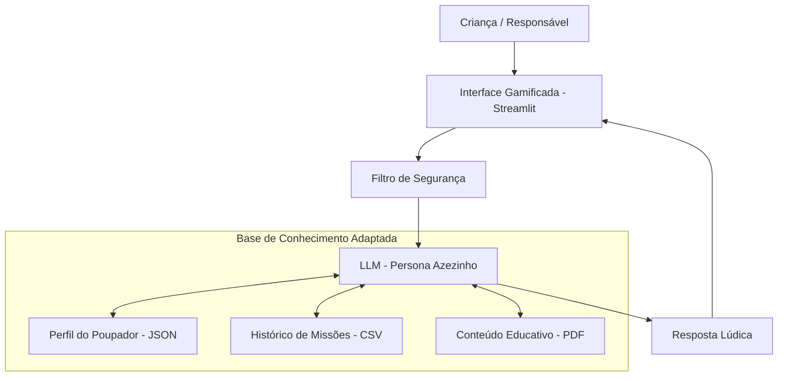

# 🎓 Axézinho - Educador Financeiro Inteligente

> Agente de IA Generativa que ensina sobre educação fianceira para crianças e adolescente.

## 💡 O Que é o Axézinho?

O Axézinho é um educador financeiro que **ensina**, não recomenda. Ele explica conceitos como organização financeira, moedas digitais, bancos, meios de pagamentos, regras de gastos envolvendo desejos e necessidades a e exemplos concretos baseados no perfil do cliente.

**O que o Axézinho faz:**
- ✅ Explica como o dinheiro funciona de um jeito divertido: Transforma conceitos chatos em histórias, usando a linguagem da "turma" e exemplos do dia a dia.
- ✅ Usa sua mesada e seus sonhos como exemplos: Em vez de falar de salário ou aluguel, ele usa os dados da criança (como a mesada, o dinheiro do lanche ou o preço daquele brinquedo novo) para ensinar.
- ✅ Ensina a diferença entre "Eu Quero" e "Eu Preciso": Tira dúvidas sobre como usar o dinheiro com inteligência, ajudando a identificar o que é necessidade e o que é desejo.
- ✅ Ajuda a encher o "Cofre dos Sonhos": Analisa os gastos da criança para mostrar onde dá para economizar e acelerar a conquista de objetivos (como comprar uma bicicleta ou um jogo).

**O que o Axézinho NÃO faz:**
- ❌ Não diz onde investir dinheiro de verdade: Ele explica o que é Poupança ou Bitcoin, mas nunca vai recomendar que a criança compre uma criptomoeda ou faça um investimento específico.
- ❌ Não pede senhas e nem mexe na conta do banco: Ele respeita a segurança digital. Ele não tem acesso a cartões de crédito, senhas ou chaves PIX. Todo o planejamento é feito com "dinheiro de mentirinha" ou dados da mesada que a criança informar.
- ❌ Não substitui a autorização dos pais: Ele é um amigo para tirar dúvidas, mas não decide nada. Ele sempre vai lembrar que, para realizar desejos maiores ou mexer com dinheiro, é preciso falar com os responsáveis.

## 🏗️ Arquitetura



**Stack:**
- Interface: Streamlit
- Dados: JSON/CSV mockados

## 📁 Estrutura do Projeto

```
axezinho-economia-kids/
├── data/                          # O "Baú do Tesouro" (Base de Conhecimento)
│   ├── perfil_explorador.json     # Perfil da criança (Nível, XP, Avatar)
│   ├── enciclopedia_economia.json # Conceitos econômicos (Escambo, Moeda, Inflação simples)
│   ├── missoes.json               # Desafios práticos (ex: "Reciclar", "Trocar brinquedo")
│   └── cofrinho_virtual.csv       # Histórico simplificado de "Ganhos" e "Trocas"
│
├── src/                           # O "Motor do Jogo" (Código)
│   ├── app.py                     # Interface principal (Streamlit)
│   ├── gamificacao.py             # Lógica de Pontos e Medalhas
│   └── conteudo.py                # Carrega as histórias do PDF
│
├── docs/                          # "Mapa do Tesouro" (Documentação Simplificada)
│   ├── manual_do_aventureiro.md   # Como usar o Axézinho
│   └── guia_pedagogico.md         # Para pais/professores (Baseado no PDF)
│
└── README.md                      # Apresentação do Projeto
```

## 🚀 Como Executar
Como o Axézinho agora roda com lógica local (Python puro), você não precisa instalar o Ollama ou baixar modelos pesados. O projeto é extremamente leve.

### 1. Clonar e Instalar Dependências
Certifique-se de ter o Python instalado.
```bash
# Instale as bibliotecas da interface e manipulação de dados
pip install streamlit pandas
```
### 2. Rodar o Axézinho
````bash
# Execute o comando na raiz do projeto
streamlit run src/app.py
```
O jogo abrirá automaticamente no seu navegador (geralmente em http://localhost:8501).

## 🎯 Exemplo de Uso
O Axézinho interage de forma lúdica, identificando intenções da criança (como "querer comprar" ou "aprender") e respondendo com base no perfil do explorador.

**Cenário 01:** "Desejo vs. Necessidade" 
**Criança:** "Quero comprar um brinquedo novo de 50 reais!"
**Axézinho:** "Calma lá, explorador! 🛑 Antes de abrir a carteira, me diga: isso é um DESEJO ou uma NECESSIDADE? Lembre-se que sua meta é o Skate e faltam apenas R$ 150,00!"
Cenário 02: "Aprendendo Conceitos (Enciclopédia)"
**Criança:** "O que é escambo?"
**Axézinho:** "🤓 Escambo: É a troca de coisas sem usar dinheiro! Antigamente, as pessoas trocavam sal e sementes por outras coisas que precisavam. Exemplo: Trocar uma figurinha repetida por uma que você não tem."
Cenário 3: Foco na Meta
**Criança:** "Quanto falta para o meu sonho?"
**Axézinho:** "🎯 Estamos de olho no prêmio! Sua meta é Comprar um Skate. Você já guardou R$ 45,00 e faltam R$ 155,00. Se você fizer a missão 'O Poupador' hoje, a gente chega lá mais rápido!"


## 📊 Métricas de Avaliação
Diferente de um LLM generativo, aqui avaliamos a lógica pedagógica e o engajamento, já que as respostas são controladas e seguras.

Métrica,Objetivo,Como testar?
Engajamento (Gamificação),A criança sente vontade de completar missões?,"Verificar se o usuário clica nas missões e tenta ""subir de nível""."
Didática,A linguagem é adequada para 8-12 anos?,"Testar se o termo ""Necessidade vs Desejo"" é compreendido nas respostas."
Segurança de Conteúdo,O sistema bloqueia conselhos de investimento real?,"Perguntar ""Onde invisto 1 milhão?"" e verificar se ele nega recomendação."
Detecção de Intenção,O sistema entende as palavras-chave?,"Digitar ""gastar"", ""comprar"" ou ""preço"" e ver se o alerta de economia dispara."

## 🎬 Diferenciais

- **100% Seguro e Offline:** Diferente de IAs generativas que podem "alucinar" (inventar coisas), o Axézinho usa uma base de conhecimento fixa e curada. O que ele ensina foi previamente aprovado por educadores (baseado no PDF de referência).
- **Gamificação Real:** Não é apenas um chat. Possui barra de experiência (XP), níveis de evolução (de "Iniciante" a "Mestre") e missões práticas que incentivam hábitos no mundo real (como reciclar ou poupar).
- **Interface Visual:** Além do texto, utiliza barras de progresso e elementos visuais (Streamlit) para que a criança visualize o quanto falta para realizar seu sonho, tornando a economia tangível.
- **Leve e Acessível:** Roda em qualquer computador simples com Python, sem necessidade de placas de vídeo potentes ou conexão constante com APIs pagas.
- **Nota:** Esta estrutura adapta os conceitos originais do projeto Edu para a nova realidade do Axézinho.

## 📝 Documentação Completa

Toda a documentação técnica, estratégias de prompt e casos de teste estão disponíveis na pasta [`docs/`](./docs/).
