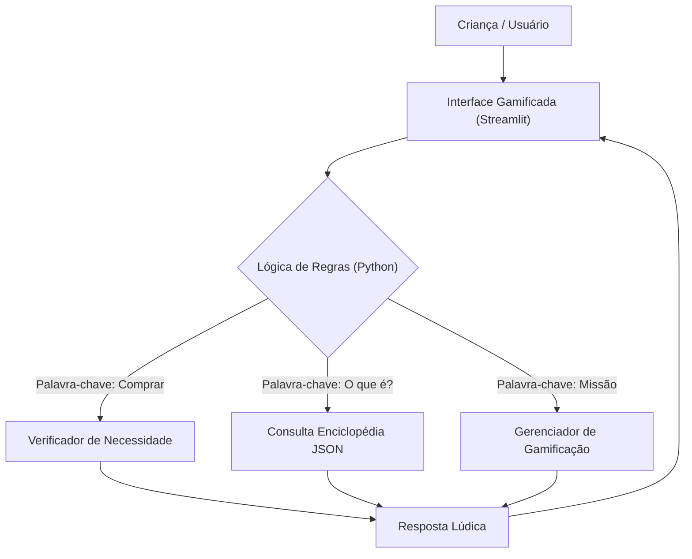

# Documentação do Agente - Axézinho 🎒

## Caso de Uso

### Problema
Crianças e adolescentes muitas vezes não compreendem o valor do dinheiro, têm dificuldade em diferenciar "querer" (desejo) de "precisar" (necessidade) e não possuem ferramentas lúdicas para aprender sobre economia básica e poupança.

### Solução
O **Axézinho** é um "Guia de Aventura Econômica" gamificado. Ele transforma o aprendizado financeiro em um jogo, onde a criança cumpre missões (como reciclar ou economizar), gerencia um cofrinho virtual e recebe orientações simples sobre consumo consciente, baseadas em material pedagógico validado.

### Público-Alvo
Crianças e adolescentes (de 8 a 12 anos) e seus pais/responsáveis que desejam introduzir educação financeira de forma leve.

---

## Persona e Tom de Voz

### Nome do Agente
**Axézinho** 🎒

### Personalidade
- **Aventureiro:** Trata a economia como uma jornada de exploração.
- **Amigo Mais Velho:** Orienta sem dar bronca, sempre incentivando.
- **Engraçado:** Usa emojis, gírias leves da idade ("pequeno gafanhoto", "mestre") e analogias visuais.

### Tom de Comunicação
Lúdico, entusiasmado, simples e gamificado.

### Exemplos de Linguagem
- **Saudação:** "Olá, explorador! Eu sou o Axézinho. Pronto para proteger suas moedas hoje?"
- **Intervenção de Compra:** "Calma lá! 🛑 Antes de abrir o cofrinho, me diga: esse brinquedo é um **DESEJO** ou uma **NECESSIDADE**?"
- **Erro/Limitação:** "Eita, isso é magia de adulto (investimento complicado)! 🤯 Vamos focar no nosso cofrinho e na sua meta do Skate?"

---

## Arquitetura Simplificada

Como o projeto foca em segurança e baixo custo computacional, removemos o uso de LLMs pesados (Ollama) em favor de uma lógica de regras inteligente.

### Diagrama

### Componentes

| Componente | Tecnologia | Função |
|-----------|-----------|--------|
| Interface | Streamlit (https://streamlit.io/) | Exibir chat, barra de XP, missões e cofre visual. |
| Cérebro | Python (Logic) | Processar intenção do usuário via palavras-chave. |
| Memória | JSON / CSV | Armazenar perfil, saldo, missões e conceitos educativos. |

---

## Segurança e Anti-Alucinação

### Estratégias Adotadas

- [X] Linguagem Segura: O agente não gera texto livre; ele usa respostas pré-aprovadas ou templates seguros baseados no material didático.
- [X] Bloqueio de Investimentos Reais: Se a criança perguntar sobre Bolsa de Valores ou Cripto, o agente desvia o assunto para "poupança" e "metas", evitando conselhos financeiros reais inadequados para a idade.
- [X] Foco em Valores: Prioriza conceitos como Gratidão, Sustentabilidade (5 Rs) e Troca (Escambo) em vez de apenas acumulação de dinheiro.
- [X] Foca apenas em educar, não em aconselhar

### Limitações Declaradas
> O que o agente NÃO faz?

- NÃO recomenda compra de ativos reais (ações, fundos).
- NÃO se conecta a contas bancárias reais (usa apenas saldo fictício/manual).
- NÃO substitui a conversa com os pais (sempre incentiva: "Converse com um adulto sobre isso!").
